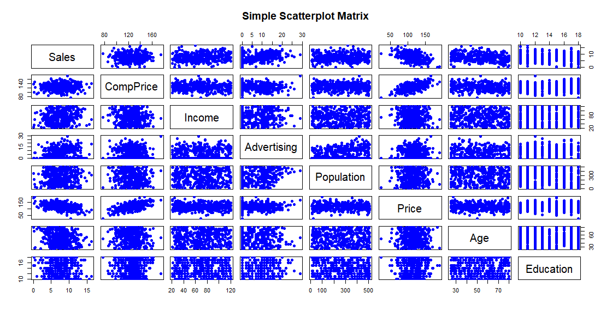
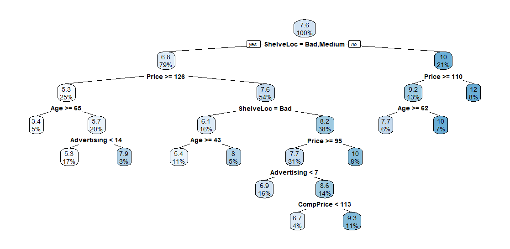

# Retail-Sales-Intelligence

## Business Objective

The objective of this analysis is to **develop a predictive model that estimates child car seat sales across different store locations** using factors such as pricing, competitor pricing, advertising spend, income, population, shelving quality, and demographic characteristics.

The model aims to identify the key factors that influence sales and provide businesses with **data-driven insights to anticipate sales performance, optimise pricing and advertising strategies, and improve retail decision-making**.

## Carseats Data Intro

The **Carseats** dataset is a simulated retail dataset containing sales information for **400 stores** selling child car seats. It provides a useful foundation for exploring the factors that influence product sales across different store locations.

The dataset combines **sales performance, pricing, advertising, demographic, and store-level characteristics**. The key outcome variable, `Sales`, represents unit sales at each location, measured in thousands. The remaining variables provide potential explanations for differences in sales, including competitor pricing (`CompPrice`), company pricing (`Price`), local advertising spend (`Advertising`), community income (`Income`), population size (`Population`), shelving quality (`ShelveLoc`), and demographic characteristics such as age and education.

The dataset also includes categorical variables describing whether a store is located in an **urban or rural area (`Urban`)** and whether it is located in the **US (`US`)**. Together, these variables allow for both **exploratory data analysis and predictive modelling** to investigate which factors are most strongly associated with car seat sales.

Overall, the Carseats dataset provides a practical example of how **business, market, and customer-location data can be combined to understand sales performance and support data-driven retail decisions**.

## High-Level Relationships of the Data

The scatterplot matrix provides an initial view of the relationships between **Sales** and the key numerical variables in the Carseats dataset. Overall, the relationships vary in strength, with **Price and Advertising showing the most noticeable associations with Sales**.

The relationship between **Sales and Price** is clearly negative, indicating that stores charging higher prices generally tend to record lower unit sales. This suggests that pricing may be an important factor influencing customer demand. In contrast, **Sales and Advertising** show a positive relationship, with higher advertising expenditure generally associated with higher sales. This indicates that investment in local advertising may contribute to improved sales performance.

There is also a **moderate positive relationship between Sales and Income**, suggesting that stores located in higher-income communities may experience somewhat higher sales. However, the relationship is relatively dispersed, indicating that income alone does not explain differences in sales.

The relationships between **Sales and CompPrice, Population, and Age** appear weaker, with no strong linear patterns evident. Similarly, **Education** does not show a clear linear relationship with Sales. The vertical bands visible for Education occur because it is measured using a limited number of discrete values.

The matrix also highlights a strong positive relationship between **CompPrice and Price**, suggesting that the company's pricing tends to move in the same direction as competitor pricing.

### Key Insight

The exploratory analysis suggests that **Price and Advertising are likely to be important predictors of Sales**, while the remaining variables may provide additional explanatory power when considered together. However, the considerable spread of observations indicates that Sales cannot be explained by a single variable. This supports the use of a **multivariable predictive model** to assess the combined influence of pricing, advertising, market conditions, and demographic characteristics on car seat sales.

 

## Fitting A Regression Tree
A regression tree was developed to predict Sales using the available explanatory variables in the Carseats dataset. The data was divided into 70% training data and 30% testing data, allowing the model to be trained on one subset and evaluated on unseen observations. RMSE (Root Mean Squared Error) was used as the primary performance metric, with MAE and R² also used to provide additional measures of model performance.
Performance (TBC)

 

